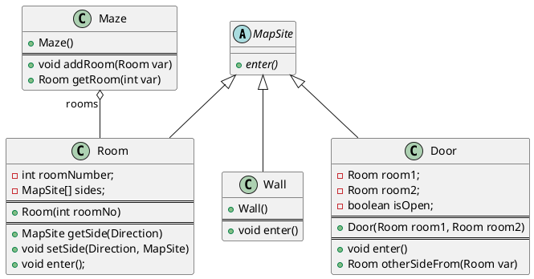
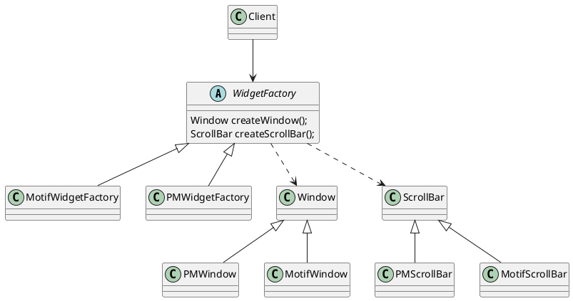

第三章 创建型模式
---
创建型模式抽象了实例化过程。它们帮助一个系统独立于如何创建、组合和表示它的那 些对象。

两个不断出现的主旋律：
  第一，它们都将关于该系统使用哪些具体的类 的信息封装起来。
  第二，它们隐藏了这些类的实例是如何被创建和放在一起的。


因为创建型模式紧密相关，我们将所有5个模式一起研究以突出它们的相似点和相异点。
我们也将举一个通用的例子 — 为一个电脑游戏创建一个迷宫— 来说明它们的实现。我们将忽略许多迷宫中的细节以及一个迷宫游戏中有一个还是多个游戏者。我们仅关注 迷宫是怎样被创建的。我们将一个迷宫定义为一系列房间，一个房间知道它的邻居;可能的 邻居要么是另一个房间，要么是一堵墙、或者是到另一个房间的一扇门。

类Room、Door和Wall定义了我们所有的例子中使用到的构件。每一个房间有四面，枚举类型来指定房间的东南西北: enum Direction {North, South, East, West}。

定义一个MazeGame来创建迷宫
```java
public MazeGame {
  public Maze createMaze() {
    Maze maze = new Maze();
    Room r1 = new Room(1);
    Room r2 = new Room(2);
    Door theDoor = new Door(r1, r2);

    maze.addRoom(r1);
    maze.addRoom(r2);

    r1.setSide(North, new Wall());
    r1.setSide(East, theDoor);
    r1.setSide(South, new Wall());
    r1.setSide(West, new Wall());

    r2.setSide(North, new Wall());
    r2.setSide(East, new Wall());
    r2.setSide(South, new Wall());
    r2.setSide(West, theDoor;

    return maze;
  }
}
```
这个函数所做的仅是创建一个有两个房间的迷宫,改变的最大障碍是对被实例化的类进行硬编码.

假设你想在一个包含(所有的东西)施了魔法的迷宫的新游戏中重用一个已有的迷宫布局。施了魔法的迷宫游戏有新的构件，像DoorNeedingSpell，它是一扇仅随着一个咒语才能被锁上和打开的门;以及EnchantedRoom，一个可以有不寻常东西的房间，比如魔法钥匙或是咒语。你怎样才能较容易的改变CreateMaze以让它用这些新类型的对象创建迷宫呢?

## 一、ABSTRACT FACTORY(抽象工厂)— 对象创建型模式
1. 意图
提供一个创建一系列相关或相互依赖对象的接口，而无需指定它们具体的类。
2. 别名  
Kit
3. 动机
一个支持多种视感( look-and-feel )标准的用户界面工具包，例如Motif和
PresentationManager。不同的视感风格为诸如滚动条、窗口和按钮等用户界面“窗口组件” 定义不同的外观和行为。
   - 定义一个抽象WidgetFactory类，这个类声明了一个用来创建每一类基本窗口组件的接口。 每一种视感标准都对应于一个具体的WidgetFactory子类, 实现那些用于创建合适视感风格的窗口组件的操作。例如，MotifWidgetFactory的CreateScrollBar操作实例化并返回一个Motif滚动条，而相应的PMWidgetFactory操作返回一个PresentationManager的滚动条。
   - WidgetFactory也增强了具体窗口组件类之间依赖关系。一个Motif的滚动条应该与Motif按钮、Motif正文编辑器一起使用，这一约束条件作为使用MotifWidgetFactory的结果被自动加上。

4. 适用性
当满足一下条件时，适合使用AbstractFactory模式
    - 该系统提供的产品独立于“产品”被创建、组合和表示
    - 系统要由多个产品系列其中一个来配置
    - 同一系列产品应当一同使用，要维持确保这个约束。
    - 当你提供一个产品类库，而只想显示它们的接口而不是实现时。

5. 结构
同`3. 动机`中结构图。

6. 参与者
`AbstractFactory (WidgetFactory)`
  声明一个创建抽象产品对象的操作接口。
`ConcreteFactory (MotifWidgetFactory，PMWidgetFactory)`
  实现创建具体产品对象的操作。
`AbstractProduct (Windows，ScrollBar)`
  为一类产品对象声明一个接口。
`ConcreteProduct (MotifWindow，MotifScrollBar)`
  定义一个将被相应的具体工厂创建的产品对象。实现AbstractProduct接口。
`Client`
  仅使用由AbstractFactory和AbstractProduct类声明的接口。
7. 协作
    - 通常在运行时刻创建一个ConcreteFactroy类的实例。这一具体的工厂创建具有特定实现的产品对象。为创建不同的产品对象，客户应使用不同的具体工厂。
    - AbstractFactory将产品对象的创建延迟到它的ConcreteFactory子类。
8. 效果
模式的优缺点
    - 它分离了抽象和具体实现
      - 因为一个工厂封装创建产品对象的责任和过程，它将客户对类的使用与类的实现分离。
      - 客户通过它们的抽象接口操纵实例。
      - 产品的类名也在具体工厂的实现中被分离;它们不出现在客户代码中。
    - 易于产品系列更换
      - 一个具体工厂类在一个应用中仅出现一次—即在它初始化的时候。使得改变一个应用的具体工厂变得很容易。
    - 它有利于产品的一致性
      - 当一个系列中的产品对象被设计成一起工作时，一个应用一次只能使用同一个系列中的对象，这一点约束要满足
    - 支持新产品族比较难
      - 难以扩展抽象工厂以生产新种类的产品。这是因为AbstractFactory接口确定了可以被创建的产品集合。
9. 实现
Abstract Factory 实现的一些指导建议：
    - Factories as singleton.
      - 一个应用中一般每个产品系列只需一个ConcreteFactory的实例。因此工厂通常最好实现为一个Singleton
    - Create the products.
      - 最通常的一个办法是为每一个产品定义一个工厂方法, 虽然这样的实现很简单，但它却要求每个产品系列都要有一个新的具体工厂子类, 即使这些产品系列的差别很小.
      - 该产品系列有很多产品，具体工厂也可以使用Prototype(3.4)模式来实现。具体工厂使用产品系列中每一个产品的原型实例来初始化，且它通过复制它的原型来创建新的产品。在基于原型的方法中，使得不是每个新的产品系列都需要一个新的具体工厂类。
    - Define extensible factories.
      - AbstractFactory通常为每一种它可以生产的产品定义一个操作。产品的种类被编码在操作型构中。增加一种新的产品要求改变AbstractFactory的接口以及所有与它相关的类。
      - 一个更灵活但不太安全的设计是给创建对象的操作增加一个参数。该参数指定 了将被创建的对象的种类。它可以是一个类标识符、一个整数、一个字符串，或其他任何可 以标识这种产品的东西。实际上使用这种方法， A b s t r a c t F a c t o r y 只需要一个“ M a k e ”操作和 一个指示要创建对象的种类的参数。这是前面已经讨论过的基于原型的和基于类的抽象工厂 的技术。

10. 示例代码
```java
class MazeFactory {
  Maze makeMaze();
  Maze makeRoom();
  Maze makeWall();
  Maze makeDoor();
}

class  MazeGame {
  Maze createMaze(MazeFactory factory) {
    Maze maze = factory.makeMaze();
    Room r1 = factory.makeRoom(1);
    Room r2 = factory.makeRoom(2);
    Door door = factory.makeDoor(r1, r2);

    maze.addRoom(r1);
    maze.addRoom(r2);

    r1.setSide(North, factory.makeWall());
    r1.setSide(East, door);
    r1.setSide(South, factory.makeWall());
    r1.setSide(West, factory.makeWall());

    r2.setSide(North, factory.makeWall());
    r2.setSide(West, door);
    r2.setSide(South, factory.makeWall());
    r2.setSide(East, factory.makeWall());
  }
}
```

11. 已知应用
使用AbstractFactory模式以达到在不同窗口系统(例如，XWindows和SunView)间的可移植性。

12. 相关模式
AbstractFactory类通常用工厂方法(FactoryMethod(3.3))实现，但它们也可以用Prototype实现。
一个具体的工厂通常是一个单件(Singleton(3.5))。

## 二、BUILDER(生成器)— 对象创建型模式
1. 意图
将一个`复杂对象`的构建与它的表示分离，使得同样的构建过程可以创建不同的表示。

2. 动机
一个RTF(RichTextFormat)文档交换格式的阅读器应能将RTF转换为多种正文格式。该阅读器可以将RTF文档转换成普通ASCII文本或转换成一个能以交互方式编辑的正文窗口组件。但问题在于可能转换的数目是无限的。因此要能够很容易实现新的转换的增加，同时却不改变RTF阅读器（结构）。
    - 当RTFReader对RTF文档进行语法分析时，它使用TextConverter去做转换
    - 每种转换器类将创建和装配一个复杂对象的机制隐含在抽象接口的后面。转换器独立于阅读器，阅读器负责对一个RTF文档进行语法分析。
    - Builder模式将分析文本格式的算法(即RTF文档的语法分析程序)与描述怎样创建和表示一个转换后格式的算法分离开来

```plantuml
RTFReader "builder" o-- TextConverter
TextConverter <|-- ASCIIConverter
TextConverter <|-- TexConverter
TextConverter <|-- TextWidgetConverter

class RTFReader {
  void parseRTF();
}

note bottom of RTFReader
while ( t= get the next token) {
  switch t.Type {
    char:
    builder.convertCharacter(t.char);
    font:
    builder.convertFontChange(t.font);
    para:
    builder.convertParagraph();
  }
}
end note

abstract class TextConverter {
  + char convertCharacter();
  + Font convertFontChange();
  + Para convertParagraph();
}

class ASCIIConverter {
  + char convertCharacter();
  + ASCIIText getASCIIText();
}

class TexConverter {
  + char convertCharacter();
  + Font convertFontChange();
  + Para convertParagraph();
  + TeXText getTexText();
}

class TextWidgetConverter {
  + char convertCharacter();
  + Font convertFontChange();
  + Para convertParagraph();
  + TextWidget getTextWidget();
}

```

3. 适用性
以下情况使用
    - 当创建复杂对象的算法应该独立于该对象的组成部分以及它们的装配方式时。获取一个内部结构复杂的对象而不关心是如何组成和关系配置的。
    - 当构造过程必须允许被构造的对象有不同的表示时。构造的产品可以不一样。

4. 结构
同`2. 意图`

5. 参与者
Builder(TextConverter)
    - 为创建一个Product对象的各个部件指定抽象接口。
ConcreteBuilder(ASCIIConverter、TeXConverter、TextWidgetConverter)
    - 实现Builder的接口以构造和装配该产品的各个部件。
    - 定义并明确它所创建的表示。
    - 提供一个检索产品的接口(例如，GetASCIIText和GetTextWidget)。
Director(RTFReader)
    - 构造一个使用Builder接口的对象。
Product(ASCIIText、TeXText、TextWidget)
    - 表示被构造的复杂对象。ConcreteBuilder创建该产品的内部表示并定义它的装配过程。—包含定义组成部件的类，包括将这些部件装配成最终产品的接口。

6. 协作
• 客户创建 D i r e c t o r对象，并用它所想要的 B u i l d e r 对象进行配置。
• 一旦产品部件被生成，导向器就会通知生成器。
• 生成器处理导向器的请求，并将部件添加到该产品中。
• 客户从生成器中检索产品。
```plantuml
Client -> Director: 创建
Client -> ConcreteBuilder: 设定具体Builder
Client -> Director: construct
activate Director

Director -> ConcreteBuilder: buildPartA()
Director -> ConcreteBuilder: buildPartB()
Director -> ConcreteBuilder: buildPartB()

deactivate Director

Client -> ConcreteBuilder: getResulte()
```

7. 效果
  - 它使你可以改变一个产品的内部表示。
  生成器可以隐藏这个产品的表示和内部结构。你在改变该产品的内部表示时所要做的只是定 义一个新的生成器。
  - 它将构造代码和表示代码分开
  每个ConcreteBuilder包含了创建和装配一个特定产品的所有代码，这些代码只需要写一次;然后不同的Director可以复用它以在相同部件集合的基础上构作不同的Product。
  - 它使你可对构造过程进行更精细的控制

8. 实现
通常有一个抽象的Builder类为导向者可能要求创建的每一个构件定义一个操作。这些操作缺省情况下什么都不做。一个ConcreteBuilder类对它有兴趣创建的构件重定义这些操作

9. 示例
```java
interface MazeBuilder{
  void buildMaze();
  void buildRoom();
  void buildDoor();

  Maze getMaze();
}

Class MazeGame {
  Maze createMaze(MazeBuilder builder) {
    builder.buildMaze();
    builder.buildRoom(1);
    builder.buildRoom(2);
    builder.buildDoor(1, 2);

    return bulder.getMaze();
  }
}
```

10. 已知应用
  - 编译子系统中的Parser类是一个Director，它以一个ProgramNodeBuilder对象作为参数。
  每当Parser对象识别出一个语法结构时，它就通知它的ProgramNodeBuilder对象。当这个语法分析器做完时，它向该生成器请求它生成的语法分析树并将语法分析树返回给客户。
  - ClassBuilder是一个生成器，Class使用它为自己创建子类。在这个例子中，一个Class既是Director也是Product。
  - ByteCodeStream是一个生成器，它将一个被编译了的方法创建为字节数组。
  ByteCodeStream不是Builder模式的标准使用，因为它生成的复杂对象被编码为一个字节数组，而不是正常的Smalltalk对象。但ByteCodeStream的接口是一个典型的生成器，而且将很容易用一个将程序表示为复合对象的不同的类来替换ByteCodeStream。

11. 相关模式
AbstractFactory(3.1)与Builder相似，因为它也可以创建复杂对象。主要的区别   
    - Builder模式着重于一步步构造一个复杂对象。
    - AbstractFactory着重于多个系列的产品对象(简单的或是复杂的)。
    - Builder在最后的一步返回产品
    - AbstractFactory来说，产品是立即返回的。

Composite(4.3)通常是用Builder生成的。 `TODO: 为什么呢？`

## 三、FACTORY METHOD(工厂方法)— 对象创建型模式
1. 意图
  让子类决定实例化哪一个类。 Factory Method使一个类的 实例化延迟到其子类。
2. 别名
3. 动机
  ```plantuml
  interface Application{
    +Document createDocument();
    +Document newDocument();
    +void openDocument();
  }

  interface Document {
  +void open();
  +void close();
  +void save();
  +void revert();
  }

  class MyDocument implements Document {

  }

  class MyApplication  implements Application {

  }

  ```
4. 适用性
  • 工厂类不知道它所必须创建的对象的类。
  • 当工厂类希望由它的子类来指定它所创建的对象。
  • 当类将创建对象的职责委托给多个子类中的某一个，并且你希望将哪一个帮助子类是代理者这一信息局部化的时候。
5. 结构
  略
6. 参与者
    Product(Document)
    - 定义工厂方法所创建的对象的接口。
    ConcreteProduct(MyDocument)
    - 实现Product接口。
    Creator(Application)
    - 声明工厂方法，该方法返回一个Product类型的对象。Creator也可以定义一个工厂方法的缺省实现，它返回一个缺省的ConcreteProduct对象。
    - 可以调用工厂方法以创建一个Product对象。
    ConcreteCreator(MyApplication)
    - 重定义工厂方法以返回一个ConcreteProduct实例。
7. 协作
  略
8. 效果
  略
9. 实现
  略
10. 代码示例
  ```java
  class MazeGame {
    + Maze createMaze() {
      Maze maze = makeMaze();
      Room r1 = makeRoom(1);
      Room r2 = makeRoom(2);
      Door door = makeDoor(r1, r2);

      maze.addRoom(r1);
      maze.addRoom(r2);
      .....
    }
    + static Maze makeMaze();
    + static Room makeRoom(int n);
    + static Wall makeWall();
    + static Door makeDoor(Room r1, Room r2);
  }
  ```
11. 已知应用
  略
12. 相关模式
AbstractFactory(3.1)经常用工厂方法来实现。AbstractFactory模式中动机一节的例子也对FactoryMethod进行了说明。
工厂方法通常在TemplateMethods(5.10)中被调用。在上面的文档例子中，NewDocument就是一个模板方法。
Prototypes(3.4)不需要创建Creator的子类。但是，它们通常要求一个针对Product类的Initialize操作。Creator使用Initialize来初始化对象。而FactoryMethod不需要这样的操作。
