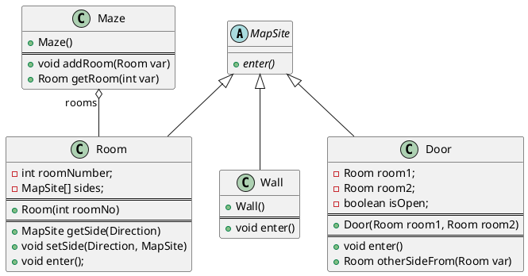
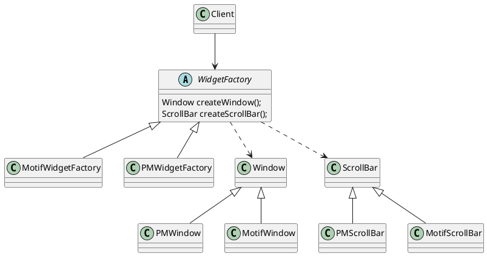

第二章 创建型模式
---
创建型模式抽象了实例化过程。它们帮助一个系统独立于如何创建、组合和表示它的那 些对象。

两个不断出现的主旋律：
  第一，它们都将关于该系统使用哪些具体的类 的信息封装起来。
  第二，它们隐藏了这些类的实例是如何被创建和放在一起的。


因为创建型模式紧密相关，我们将所有5个模式一起研究以突出它们的相似点和相异点。
我们也将举一个通用的例子 — 为一个电脑游戏创建一个迷宫— 来说明它们的实现。我们将忽略许多迷宫中的细节以及一个迷宫游戏中有一个还是多个游戏者。我们仅关注 迷宫是怎样被创建的。我们将一个迷宫定义为一系列房间，一个房间知道它的邻居;可能的 邻居要么是另一个房间，要么是一堵墙、或者是到另一个房间的一扇门。

类Room、Door和Wall定义了我们所有的例子中使用到的构件。每一个房间有四面，枚举类型来指定房间的东南西北: enum Direction {North, South, East, West}。

定义一个MazeGame来创建迷宫
```java
public MazeGame {
  public Maze createMaze() {
    Maze maze = new Maze();
    Room r1 = new Room(1);
    Room r2 = new Room(2);
    Door theDoor = new Door(r1, r2);

    maze.addRoom(r1);
    maze.addRoom(r2);

    r1.setSide(North, new Wall());
    r1.setSide(East, theDoor);
    r1.setSide(South, new Wall());
    r1.setSide(West, new Wall());

    r2.setSide(North, new Wall());
    r2.setSide(East, new Wall());
    r2.setSide(South, new Wall());
    r2.setSide(West, theDoor;

    return maze;
  }
}
```
这个函数所做的仅是创建一个有两个房间的迷宫,改变的最大障碍是对被实例化的类进行硬编码.

假设你想在一个包含(所有的东西)施了魔法的迷宫的新游戏中重用一个已有的迷宫布局。施了魔法的迷宫游戏有新的构件，像DoorNeedingSpell，它是一扇仅随着一个咒语才能被锁上和打开的门;以及EnchantedRoom，一个可以有不寻常东西的房间，比如魔法钥匙或是咒语。你怎样才能较容易的改变CreateMaze以让它用这些新类型的对象创建迷宫呢?

## 一、ABSTRACT FACTORY(抽象工厂)— 对象创建型模式
1. 意图
提供一个创建一系列相关或相互依赖对象的接口，而无需指定它们具体的类。
2. 别名  
Kit
3. 动机
一个支持多种视感( look-and-feel )标准的用户界面工具包，例如Motif和
PresentationManager。不同的视感风格为诸如滚动条、窗口和按钮等用户界面“窗口组件” 定义不同的外观和行为。
   - 定义一个抽象WidgetFactory类，这个类声明了一个用来创建每一类基本窗口组件的接口。 每一种视感标准都对应于一个具体的WidgetFactory子类, 实现那些用于创建合适视感风格的窗口组件的操作。例如，MotifWidgetFactory的CreateScrollBar操作实例化并返回一个Motif滚动条，而相应的PMWidgetFactory操作返回一个PresentationManager的滚动条。
   - WidgetFactory也增强了具体窗口组件类之间依赖关系。一个Motif的滚动条应该与Motif按钮、Motif正文编辑器一起使用，这一约束条件作为使用MotifWidgetFactory的结果被自动加上。

4. 适用性
当满足一下条件时，适合使用AbstractFactory模式
    - 该系统提供的产品独立于“产品”被创建、组合和表示
    - 系统要由多个产品系列其中一个来配置
    - 同一系列产品应当一同使用，要维持确保这个约束。
    - 当你提供一个产品类库，而只想显示它们的接口而不是实现时。

5. 结构
同`3. 动机`中结构图。

6. 参与者
`AbstractFactory (WidgetFactory)`
  声明一个创建抽象产品对象的操作接口。
`ConcreteFactory (MotifWidgetFactory，PMWidgetFactory)`
  实现创建具体产品对象的操作。
`AbstractProduct (Windows，ScrollBar)`
  为一类产品对象声明一个接口。
`ConcreteProduct (MotifWindow，MotifScrollBar)`
  定义一个将被相应的具体工厂创建的产品对象。实现AbstractProduct接口。
`Client`
  仅使用由AbstractFactory和AbstractProduct类声明的接口。
7. 协作
    - 通常在运行时刻创建一个ConcreteFactroy类的实例。这一具体的工厂创建具有特定实现的产品对象。为创建不同的产品对象，客户应使用不同的具体工厂。
    - AbstractFactory将产品对象的创建延迟到它的ConcreteFactory子类。
8. 效果
模式的优缺点
    - 它分离了抽象和具体实现
      - 因为一个工厂封装创建产品对象的责任和过程，它将客户对类的使用与类的实现分离。
      - 客户通过它们的抽象接口操纵实例。
      - 产品的类名也在具体工厂的实现中被分离;它们不出现在客户代码中。
    - 易于产品系列更换
      - 一个具体工厂类在一个应用中仅出现一次—即在它初始化的时候。使得改变一个应用的具体工厂变得很容易。
    - 它有利于产品的一致性
      - 当一个系列中的产品对象被设计成一起工作时，一个应用一次只能使用同一个系列中的对象，这一点约束要满足
    - 支持新产品族比较难
      - 难以扩展抽象工厂以生产新种类的产品。这是因为AbstractFactory接口确定了可以被创建的产品集合。
9. 实现
Abstract Factory 实现的一些指导建议：
    - Factories as singleton.
      - 一个应用中一般每个产品系列只需一个ConcreteFactory的实例。因此工厂通常最好实现为一个Singleton
    - Create the products.
      - 最通常的一个办法是为每一个产品定义一个工厂方法, 虽然这样的实现很简单，但它却要求每个产品系列都要有一个新的具体工厂子类, 即使这些产品系列的差别很小.
      - 该产品系列有很多产品，具体工厂也可以使用Prototype(3.4)模式来实现。具体工厂使用产品系列中每一个产品的原型实例来初始化，且它通过复制它的原型来创建新的产品。在基于原型的方法中，使得不是每个新的产品系列都需要一个新的具体工厂类。
    - Define extensible factories.
      - AbstractFactory通常为每一种它可以生产的产品定义一个操作。产品的种类被编码在操作型构中。增加一种新的产品要求改变AbstractFactory的接口以及所有与它相关的类。
      - 一个更灵活但不太安全的设计是给创建对象的操作增加一个参数。该参数指定 了将被创建的对象的种类。它可以是一个类标识符、一个整数、一个字符串，或其他任何可 以标识这种产品的东西。实际上使用这种方法， A b s t r a c t F a c t o r y 只需要一个“ M a k e ”操作和 一个指示要创建对象的种类的参数。这是前面已经讨论过的基于原型的和基于类的抽象工厂 的技术。

10. 示例代码
略
11. 已知应用
使用AbstractFactory模式以达到在不同窗口系统(例如，XWindows和SunView)间的可移植性。
12. 相关模式
AbstractFactory类通常用工厂方法(FactoryMethod(3.3))实现，但它们也可以用Prototype实现。
一个具体的工厂通常是一个单件(Singleton(3.5))。
