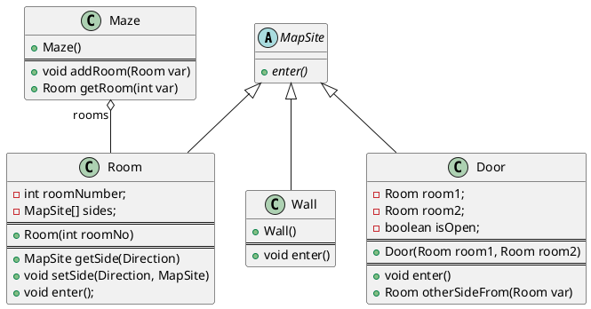

第二章 创建型模式
---
创建型模式抽象了实例化过程。它们帮助一个系统独立于如何创建、组合和表示它的那 些对象。

两个不断出现的主旋律：
  第一，它们都将关于该系统使用哪些具体的类 的信息封装起来。
  第二，它们隐藏了这些类的实例是如何被创建和放在一起的。


因为创建型模式紧密相关，我们将所有5个模式一起研究以突出它们的相似点和相异点。
我们也将举一个通用的例子 — 为一个电脑游戏创建一个迷宫— 来说明它们的实现。我们将忽略许多迷宫中的细节以及一个迷宫游戏中有一个还是多个游戏者。我们仅关注 迷宫是怎样被创建的。我们将一个迷宫定义为一系列房间，一个房间知道它的邻居;可能的 邻居要么是另一个房间，要么是一堵墙、或者是到另一个房间的一扇门。

类Room、Door和Wall定义了我们所有的例子中使用到的构件。每一个房间有四面，枚举类型来指定房间的东南西北: enum Direction {North, South, East, West}。

定义一个MazeGame来创建迷宫
```java
public MazeGame {
  public Maze createMaze() {
    Maze maze = new Maze();
    Room r1 = new Room(1);
    Room r2 = new Room(2);
    Door theDoor = new Door(r1, r2);

    maze.addRoom(r1);
    maze.addRoom(r2);

    r1.setSide(North, new Wall());
    r1.setSide(East, theDoor);
    r1.setSide(South, new Wall());
    r1.setSide(West, new Wall());

    r2.setSide(North, new Wall());
    r2.setSide(East, new Wall());
    r2.setSide(South, new Wall());
    r2.setSide(West, theDoor;

    return maze;
  }
}
```
这个函数所做的仅是创建一个有两个房间的迷宫,改变的最大障碍是对被实例化的类进行硬编码.

假设你想在一个包含(所有的东西)施了魔法的迷宫的新游戏中重用一个已有的迷宫布局。施了魔法的迷宫游戏有新的构件，像DoorNeedingSpell，它是一扇仅随着一个咒语才能被锁上和打开的门;以及EnchantedRoom，一个可以有不寻常东西的房间，比如魔法钥匙或是咒语。你怎样才能较容易的改变CreateMaze以让它用这些新类型的对象创建迷宫呢?

# 一、ABSTRACT FACTORY(抽象工厂)— 对象创建型模式
1. 意图
提供一个创建一系列相关或相互依赖对象的接口，而无需指定它们具体的类。
2. 别名  
Kit
3. 动机
